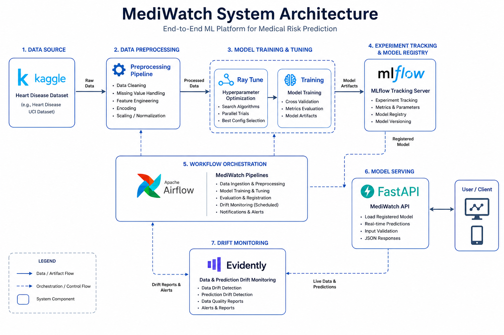
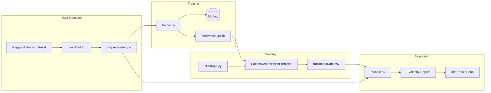
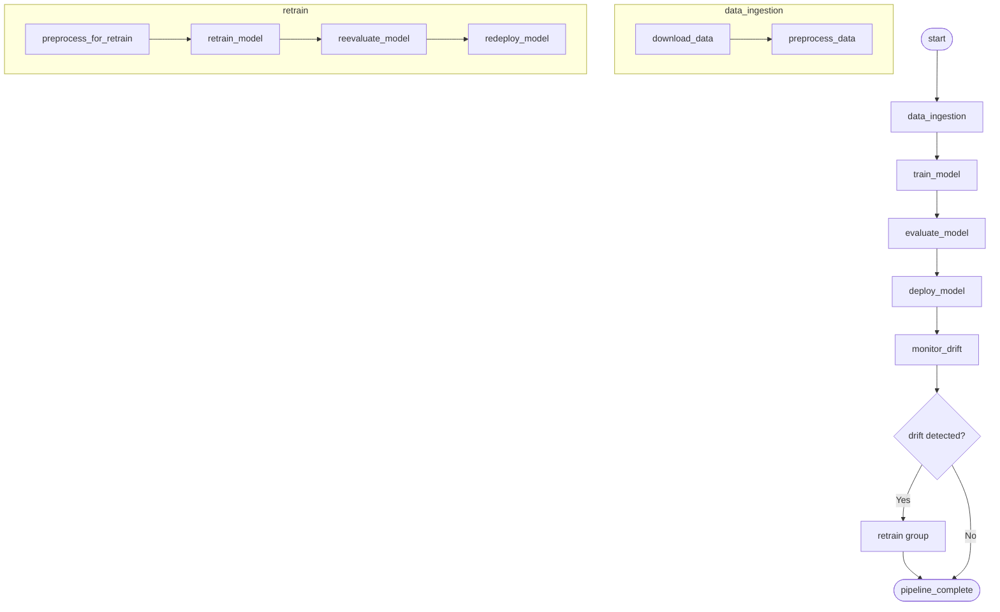

# MediWatch Architecture

This document describes how MediWatch components connect, how data flows through the system, and how orchestration layers interact.

---

## High-level architecture



MediWatch follows a **modular pipeline architecture**:

1. **Data layer** — raw CSV in `input/`, processed CSV in `output/`
2. **ML layer** — Python scripts in `pythonScripts/`
3. **Orchestration layer** — Airflow DAGs + wrapper shell scripts
4. **Serving layer** — FastAPI webapp with prediction + monitoring UI
5. **Observability layer** — MLflow (experiments), Evidently (drift), `app.log` (application logs)

---

## Data flow



---

## ML pipeline lifecycle (`mediwatch_ml_pipeline`)



**Evaluation gate:** `evaluator.py` must pass `MIN_ACCURACY` (0.50) and `MIN_F1` (0.40) before deployment proceeds.

**Retrain trigger:** `monitor.py` writes `dataset_drift: true` to `driftResults.json` when ≥ 50% of features show drift.

---

## Deployment topology

### Local development

```
Developer machine
├── .venv/                    Python virtual environment
├── wrapperScripts/           Shell entry points
├── pythonScripts/            ML logic
├── webapp/                   FastAPI (port 8800)
└── Docker (optional)
    ├── MLflow :5050
    ├── Ray :8265 / :10001
    └── Airflow :8080
```

### Airflow container layout

```
/opt/airflow/
├── dags/                     DAG Python files (mounted from airflow/dags/)
├── mediwatch/                Full project (mounted from host)
│   ├── input/
│   ├── output/
│   ├── pythonScripts/
│   └── wrapperScripts/
└── logs/                     Task execution logs
```

The Airflow custom image (`Dockerfile.airflow`) pre-installs `requirements.txt` so tasks do not create a venv at runtime.

### Ray Tune cluster

```
dockerScripts/dockercompose-raytune.yml
├── mlflow:5050               Experiment tracking (SQLite backend)
├── ray-head:8265,10001       Dashboard + client port
└── ray-worker                Executes Ray Tune trials
```

The tuner driver (`tuner.py`) runs on the host and connects via `ray://127.0.0.1:10001`. Trial workers log metrics to MLflow at `http://mlflow:5050` (internal) / `http://127.0.0.1:5050` (host).

---

## Web application architecture

```
Browser
  │
  ├─ GET  /              → index.html (Jinja2 form)
  ├─ POST /predict       → clientApp.py → encodedValues → PatientReadmissionPredictor
  ├─ GET  /monitoring    → monitoring.html (drift dashboard)
  └─ GET  /monitoring/json → JSON drift API
```

**Prediction flow:**

1. User submits form → JSON payload to `/predict`
2. `encodedValues.get_encodedValue()` maps UI labels to model feature names/encodings
3. `PatientReadmissionPredictor` loads `mediwatch.joblib`, runs inference
4. Result mapped to human-readable readmission class
5. Input record appended to `trackInputData.csv` via `monitor_utils.append_input()`

---

## Model artifact lifecycle

```
trainer.py
  └─► output/mediwatch.joblib          (staging)

run_deploy_inAirflow.sh
  ├─► output/mediwatch_production.joblib   (production copy)
  ├─► output/mediwatch.joblib              (serving path, refreshed)
  └─► output/deployment.json               (manifest with timestamp)
```

---

## Technology stack summary

| Layer | Technology |
|---|---|
| Language | Python 3.10+ |
| ML framework | scikit-learn (RandomForestClassifier) |
| Experiment tracking | MLflow 3.x |
| HPO | Ray Tune 2.57.0 |
| Drift detection | Evidently 0.7.x |
| Web framework | FastAPI + Jinja2 templates |
| Orchestration | Apache Airflow 2.7.2 (CeleryExecutor) |
| Containers | Docker + Docker Compose |
| CI/CD | GitHub Actions (`.github/workflows/ci-cd.yaml`) |

---

## Security notes (development setup)

This project is configured for **local development**:

- Airflow default credentials (`airflow`/`airflow`)
- CORS open on webapp (`allow_origins=["*"]`)
- MLflow and Ray ports exposed on localhost
- No authentication on prediction API

Do not deploy this configuration to production without adding authentication, secrets management, and network isolation.
