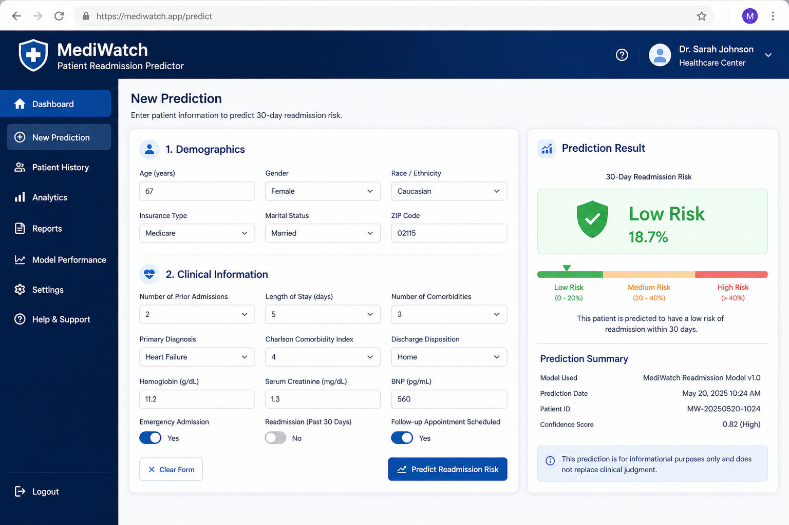
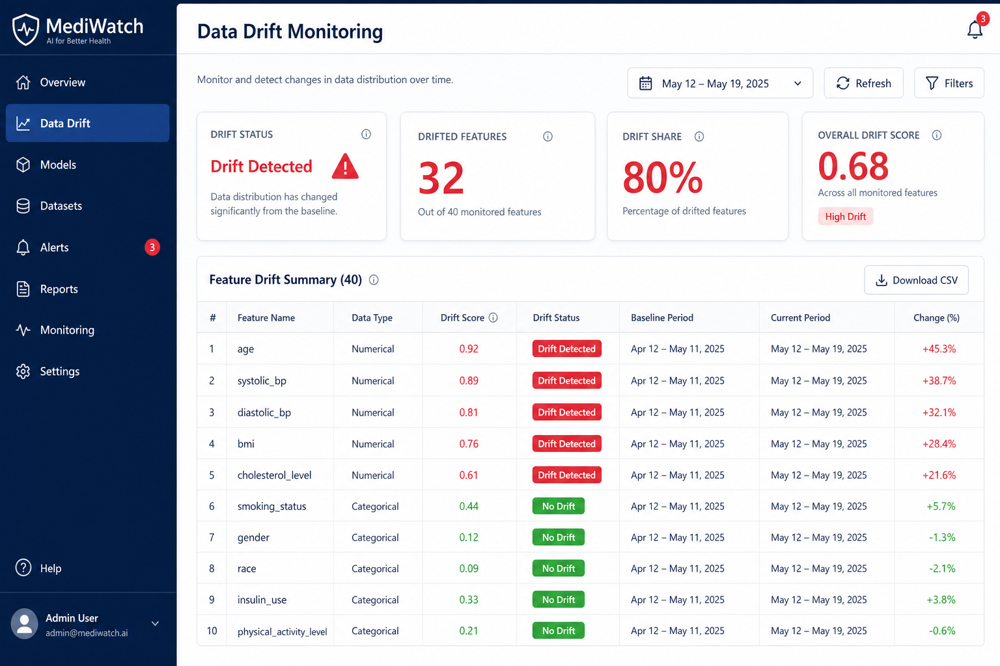

# MediWatch Video Walkthrough Guide

This document provides a **shot-by-shot script** for recording a demo video of MediWatch. Follow this guide to produce a 10–15 minute walkthrough covering the full pipeline.

> **How to record:** Use QuickTime (macOS), OBS Studio (cross-platform), or Loom. Record at 1920×1080 resolution. Narrate each step using the script below.

---

## Video outline

| Section | Duration | Topic |
|---|---|---|
| 1 | 0:00–1:30 | Introduction & architecture overview |
| 2 | 1:30–4:00 | Local setup and data pipeline |
| 3 | 4:00–6:00 | Model training and MLflow |
| 4 | 6:00–8:00 | Prediction webapp demo |
| 5 | 8:00–9:30 | Drift monitoring dashboard |
| 6 | 9:30–12:00 | Airflow orchestration |
| 7 | 12:00–13:00 | Wrap-up |

---

## Section 1: Introduction (0:00–1:30)

**Screen:** Show `docs/snapshots/architecture-diagram.png` or the ARCHITECTURE.md mermaid diagram.

**Narration script:**

> "MediWatch is an end-to-end machine learning pipeline that predicts hospital readmission risk for diabetic patients. It covers data ingestion from Kaggle, preprocessing, Random Forest training with MLflow experiment tracking, hyperparameter tuning with Ray Tune, deployment, drift monitoring with Evidently, and a FastAPI prediction webapp — all orchestrated by Apache Airflow."

**Show:** Project directory structure in terminal:

```bash
ls -la
tree -L 2  # if available
```

Highlight: `input/`, `output/`, `pythonScripts/`, `webapp/`, `wrapperScripts/`, `airflow/`.

---

## Section 2: Local setup & data pipeline (1:30–4:00)

**Screen:** Terminal

```bash
export HOME_PATH="$(pwd)"
cd "$HOME_PATH"

# Show dependencies
cat requirements.txt

# Download
./wrapperScripts/download.sh
ls -la input/

# Preprocess
./wrapperScripts/run_preprocessing.sh
ls -la output/
head -3 output/diabetic_data_processed.csv
```

**Narration:**

> "We start by downloading the Kaggle diabetes dataset into the input folder, then running preprocessing which encodes categorical features and writes the processed CSV to output."

**Optional:** Open `pythonScripts/preprocessing.py` briefly to show encoding logic.

---

## Section 3: Training & MLflow (4:00–6:00)

**Screen:** Terminal + browser

```bash
# Start MLflow + Ray
docker compose -f dockerScripts/dockercompose-raytune.yml up -d --build

# Train
./wrapperScripts/run_trainer.sh
ls -la output/mediwatch.joblib
```

**Switch to browser:** http://127.0.0.1:5050/

**Narration:**

> "Training fits a Random Forest classifier and logs parameters, metrics, and the model artifact to MLflow. Here in the MLflow UI we can compare experiment runs, view accuracy and F1 scores, and download the model."

**Show in MLflow UI:**

1. Experiments list
2. Click latest run → Metrics tab (accuracy, precision, recall, f1)
3. Artifacts tab → model folder

**Optional — Ray Tune:**

```bash
./wrapperScripts/run_tuner.sh
```

Show Ray dashboard at http://127.0.0.1:8265/

---

## Section 4: Prediction webapp (6:00–8:00)

**Screen:** Browser at http://127.0.0.1:8800/

```bash
./wrapperScripts/run_webApp.sh
```

**Narration:**

> "The webapp provides a form for clinicians or analysts to enter patient details and get a readmission risk prediction."

**Demo steps on screen:**

1. Show the predictor UI (see snapshot below)
2. Fill in Demographics: Race, Gender, Age
3. Fill Admission fields (use example values from the form placeholders)
4. Select a Diagnosis
5. Click **Predict Readmission Risk**
6. Show result panel: High / Moderate / Low risk badge



**Show API call (optional):**

```bash
curl -X POST http://127.0.0.1:8800/predict \
  -H "Content-Type: application/json" \
  -d '{"race":"Caucasian","gender":"Female","age":"[50-60)","admission_type_id":1,...}'
```

---

## Section 5: Drift monitoring (8:00–9:30)

**Screen:** Browser at http://127.0.0.1:8800/monitoring

**Narration:**

> "After predictions accumulate in the tracking file, the monitoring dashboard compares live inputs against the training reference data using Evidently AI. Features with drift scores above the threshold are flagged in red."

**Show:**

1. Summary cards (Dataset Status, Drifted Features, Drift Share)
2. Feature table — sort by score, filter drift-only
3. Search for a specific feature



**Terminal (optional):**

```bash
cat output/driftResults.json | python3 -m json.tool | head -30
```

---

## Section 6: Airflow orchestration (9:30–12:00)

**Screen:** Terminal + browser

```bash
docker compose -f airflow/dockercompose-airflow up -d --build
```

**Browser:** http://127.0.0.1:8080/ — login `airflow` / `airflow`

**Narration:**

> "For production-style orchestration, the mediwatch_ml_pipeline DAG automates the full lifecycle: data ingestion, training, evaluation with metric gates, deployment, drift monitoring, and automatic retraining when drift is detected."

**Show in Airflow UI:**

1. DAGs list — highlight `mediwatch_ml_pipeline`
2. Open Graph view — walk through task groups
3. Trigger DAG manually (play button)
4. Show task instance logs for `train_model` or `evaluate_model`

**CLI trigger (optional):**

```bash
docker compose -f airflow/dockercompose-airflow exec airflow-scheduler \
  airflow dags trigger mediwatch_ml_pipeline
```

**Explain stages:**

| Stage | Task | What happens |
|---|---|---|
| Ingestion | download + preprocess | Fresh data |
| Training | train_model | Random Forest + MLflow |
| Evaluation | evaluate_model | Accuracy/F1 gate |
| Deployment | deploy_model | Promote to production |
| Monitoring | monitor_drift | Evidently check |
| Retrain | retrain group | Runs if drift detected |

---

## Section 7: Wrap-up (12:00–13:00)

**Screen:** Architecture diagram

**Narration:**

> "MediWatch demonstrates a complete MLOps workflow: reproducible training, experiment tracking, gated deployment, live monitoring, and automated retraining. All code, documentation, and wrapper scripts are in the repository under docs/. Thank you for watching."

**Show:** `docs/README.md` index with links to User Manual, Code Reference, and Architecture docs.

---

## Recording checklist

- [ ] Terminal font size ≥ 14pt for readability
- [ ] Browser zoom at 100% or 110%
- [ ] Close unrelated tabs and notifications
- [ ] Pre-run pipeline once so outputs exist (faster demo)
- [ ] Have Docker containers running before recording Airflow/MLflow sections
- [ ] Save recording as `docs/snapshots/mediwatch-walkthrough.mp4`

## Embedding the video

Once recorded, place the file at:

```
docs/snapshots/mediwatch-walkthrough.mp4
```

And add to `docs/README.md`:

```markdown
## Demo video

[Watch the full walkthrough](./snapshots/mediwatch-walkthrough.mp4)
```

Or upload to YouTube/Loom and link from the README.

---

## Snapshot reference

All screenshots used in this guide and documentation are in `docs/snapshots/`:

| File | Description |
|---|---|
| `architecture-diagram.png` | System architecture |
| `predictor-ui.png` | Prediction webapp UI |
| `monitoring-ui.png` | Drift monitoring dashboard |

Replace these with actual screenshots from your running instance for the most accurate demo:

```bash
# macOS screenshot to clipboard, then save:
# Cmd+Shift+4 → select window → save to docs/snapshots/
```
